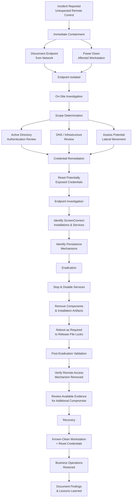

# Windows Unauthorized Remote Access Incident Response

> **Real-World Incident Response Case Study | Windows | Active Directory | Endpoint Investigation**

## Overview

This repository documents a sanitized real-world cybersecurity incident involving unauthorized remote access to a Windows workstation through a social-engineering attack.

An end user interacted with what appeared to be a legitimate QuickBooks confirmation prompt. The interaction resulted in the unauthorized installation of ScreenConnect remote-access software, allowing an external actor to establish interactive control of the workstation.

The response required immediate remote containment, on-site investigation, infrastructure review, credential remediation, endpoint examination, persistence removal, validation, and restoration of business operations.

The incident was successfully contained and remediated. Review of the evidence available during the investigation identified no indication that the compromise extended beyond the affected endpoint.

> **Privacy Notice:** Organizational identifiers, usernames, hostnames, network information, and other sensitive details have been removed or generalized. The incident identifier used in this case study is fictional and exists solely for portfolio documentation.

---

## Incident Summary

| Attribute | Description |
|---|---|
| **Incident** | Unauthorized Remote Access |
| **Severity** | High |
| **Initial Access** | Social Engineering |
| **Affected System** | Windows Workstation |
| **Remote Access Tool** | ScreenConnect |
| **Environment** | Windows / Active Directory |
| **Initial Containment** | Network isolation and shutdown |
| **Scope Identified** | Single endpoint |
| **Credential Response** | User password reset |
| **Persistence** | Multiple ScreenConnect installations/services |
| **Outcome** | Contained, eradicated, recovered |
| **Investigation Limitation** | No centralized SIEM or enterprise EDR telemetry |

---
## Detailed Documentation

For the complete chronological response, including containment, infrastructure assessment, endpoint investigation, eradication, validation, and recovery:

➡️ **[View the Full Incident Timeline](docs/incident-timeline.md)**
## Incident Response Workflow

---
## Skills Demonstrated

### Incident Response
- Initial incident triage
- Containment
- Scope determination
- Eradication
- Recovery
- Post-incident documentation

### Windows Administration
- Windows service investigation
- File ownership and permissions
- Process and persistence analysis
- Startup and scheduled-task inspection
- File-lock remediation
- System restart and validation

### Active Directory
- Authentication review
- Account activity analysis
- Credential remediation
- Domain password reset
- Privileged authentication review

### Network Security
- Endpoint network isolation
- Lateral-movement assessment
- Infrastructure scope determination
- DNS review
- Remote-access investigation

### Security Analysis
- Indicator identification
- Persistence analysis
- Evidence-based scope determination
- Documentation of investigative limitations
- Separation of confirmed findings from assumptions
---

## Investigation Methodology

The investigation was guided by a series of questions intended to establish the scope and impact of the incident:

1. Was unauthorized remote access successfully established?
2. What software or mechanism provided that access?
3. Did the threat actor establish persistence?
4. Were user credentials potentially exposed?
5. Was privileged or administrative authentication observed?
6. Was there evidence of lateral movement?
7. Were additional endpoints affected?
8. Could the unauthorized access mechanism be completely removed?
9. Could business operations be safely restored without returning the affected endpoint directly to production?

The response prioritized containment before detailed investigation. Once the affected endpoint was isolated, available infrastructure and authentication evidence was reviewed to determine whether the incident appeared to extend beyond the original workstation.

Because interactive access to an authenticated workstation had occurred, the affected user's credentials were treated as potentially exposed even though credential theft was not directly observed.

---

## Investigation Limitations

The environment did not have centralized SIEM telemetry or enterprise EDR forensic capabilities available during the investigation.

Scope determination therefore relied on available evidence including:

- Windows endpoint examination
- Active Directory authentication information
- Windows event information
- DNS and infrastructure observations
- Installed software and directories
- Running and configured services
- Startup and persistence mechanisms
- Direct examination of the affected workstation

As a result, conclusions were limited to what the available evidence could support.

> **No evidence of lateral movement was identified** means that no evidence of lateral movement was discovered within the available telemetry and artifacts. It does not establish that such activity was technically impossible.

This distinction was maintained throughout the investigation to avoid overstating the confidence of the findings.

---

## Lessons Learned

- **Rapid containment matters.** Immediate network isolation terminated the observed remote session and reduced the opportunity for continued attacker activity.

- **Social engineering can bypass technical defenses.** The initial access vector relied on user interaction with a deceptive prompt rather than exploitation of a traditional software vulnerability.

- **Potential credential exposure should be treated conservatively.** Interactive control of an authenticated workstation justified resetting the affected user's credentials even without direct evidence of credential theft.

- **Ending a remote session is not eradication.** Services, executables, installation directories, scheduled tasks, startup mechanisms, and other persistence methods must be evaluated before remediation can be considered complete.

- **Visibility affects investigative confidence.** The absence of centralized SIEM and enterprise EDR telemetry limited retrospective analysis and demonstrated the operational value of centralized logging and endpoint visibility.

- **Documentation is part of incident response.** Recording the timeline, evidence, decisions, remediation actions, and investigative limitations provides a reference for future incidents and security-awareness efforts.

---

## Final Assessment

An unauthorized external actor successfully obtained interactive remote access to a Windows workstation following a social-engineering event involving deceptive software installation.

Immediate endpoint isolation terminated the observed remote session and prevented continued network communication from the affected workstation.

Subsequent investigation identified multiple ScreenConnect installations and associated persistent services. The identified remote-access components and persistence mechanisms were removed, and potentially exposed user credentials were reset.

Review of available Active Directory, DNS, Windows authentication, and endpoint evidence did not identify indications of lateral movement, privilege escalation, unauthorized administrative authentication, or compromise involving additional systems.

Because centralized SIEM and enterprise EDR forensic telemetry were not available, these conclusions are limited to the evidence accessible during the investigation.

Following eradication and validation, the affected user was restored to normal operations using a known-clean workstation and newly reset credentials.

**Incident disposition: Contained → Investigated → Eradicated → Recovered**

---

## Repository Contents

- **`README.md`** — Executive case study, investigation methodology, workflow, findings, and lessons learned.
- **[`docs/incident-timeline.md`](docs/incident-timeline.md)** — Detailed chronological incident-response timeline.

---

## Disclaimer

This repository is intended solely as a professional cybersecurity portfolio case study.

The incident described is based on a real-world event; however, organizational identifiers, personnel information, network information, and sensitive infrastructure details have been removed or generalized.

The incident identifier and sanitized technical descriptions are included to demonstrate incident-response methodology, investigative reasoning, remediation, and technical documentation practices.
