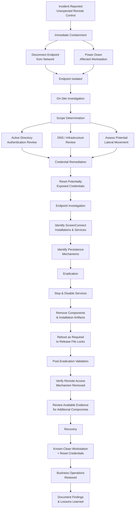

# Windows Unauthorized Remote Access Incident Response

> **Real-World Incident Response Case Study | Windows | Active Directory | Endpoint Investigation**

## Overview

This repository documents a sanitized real-world cybersecurity incident involving unauthorized remote access to a Windows workstation through a social-engineering attack.

An end user interacted with what appeared to be a legitimate QuickBooks confirmation prompt. The interaction resulted in the unauthorized installation of ScreenConnect remote-access software, allowing an external actor to establish interactive control of the workstation.

The response required immediate remote containment, on-site investigation, infrastructure review, credential remediation, endpoint examination, persistence removal, validation, and restoration of business operations.

The incident was successfully contained and remediated. Review of the evidence available during the investigation identified no indication that the compromise extended beyond the affected endpoint.

> **Privacy Notice:** Organizational identifiers, usernames, hostnames, network information, and other sensitive details have been removed or generalized. The incident identifier used in this case study is fictional and exists solely for portfolio documentation.

---

## Incident Summary

| Attribute | Description |
|---|---|
| **Incident** | Unauthorized Remote Access |
| **Severity** | High |
| **Initial Access** | Social Engineering |
| **Affected System** | Windows Workstation |
| **Remote Access Tool** | ScreenConnect |
| **Environment** | Windows / Active Directory |
| **Initial Containment** | Network isolation and shutdown |
| **Scope Identified** | Single endpoint |
| **Credential Response** | User password reset |
| **Persistence** | Multiple ScreenConnect installations/services |
| **Outcome** | Contained, eradicated, recovered |
| **Investigation Limitation** | No centralized SIEM or enterprise EDR telemetry |

---
## Detailed Documentation

For the complete chronological response, including containment, infrastructure assessment, endpoint investigation, eradication, validation, and recovery:

➡️ **[View the Full Incident Timeline](docs/incident-timeline.md)**
## Incident Response Workflow

---
## Skills Demonstrated

### Incident Response
- Initial incident triage
- Containment
- Scope determination
- Eradication
- Recovery
- Post-incident documentation

### Windows Administration
- Windows service investigation
- File ownership and permissions
- Process and persistence analysis
- Startup and scheduled-task inspection
- File-lock remediation
- System restart and validation

### Active Directory
- Authentication review
- Account activity analysis
- Credential remediation
- Domain password reset
- Privileged authentication review

### Network Security
- Endpoint network isolation
- Lateral-movement assessment
- Infrastructure scope determination
- DNS review
- Remote-access investigation

### Security Analysis
- Indicator identification
- Persistence analysis
- Evidence-based scope determination
- Documentation of investigative limitations
- Separation of confirmed findings from assumptions
